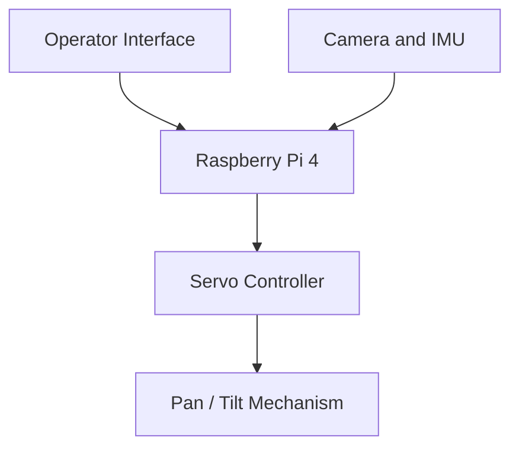

# System Concept

## Document Status

**Project phase:** Planning and preparation
**System version:** Initial concept
**Last updated:** August 2026

This document describes the planned system structure of the Humanoid Head project. It separates confirmed decisions from planned and future functions.

## Status Definitions

| Status | Meaning |
|---|---|
| **Confirmed** | Component or technical direction has been selected |
| **Planned** | Intended for the initial development stage |
| **Under Evaluation** | Not yet finally decided |
| **Future** | Intended for a later development stage |

## Project Objective

The project is a modular 2-DoF active vision head for learning and applying robotics, motion control, perception and system integration.

The first system is not intended to represent a complete humanoid robot. It is designed as a manageable development platform that can be expanded step by step.

## Initial Functional Scope

The initial development stage includes:

- Pan and tilt head movement
- Position-controlled servo actuation
- Camera-based visual input
- Orientation and motion sensing
- Raspberry Pi-based system control
- Local operator interface
- Structured testing and technical documentation

## Planned System Architecture

## System Areas

### Mechanical System

**Status: Planned**

The first mechanical system provides two controlled degrees of freedom:

- Pan: horizontal head rotation
- Tilt: vertical head rotation

The structure is planned around:

- A fixed base
- A supported pan axis
- A tilt frame
- Servo mounting points
- Bearings for mechanical load support
- Central cable routing where possible
- A modular camera and sensor carrier

The servos should generate motion but should not carry all structural loads directly.

### Motion System

**Status: Confirmed direction**

Two Feetech ST3215 serial bus servos have been selected for the initial pan and tilt axes.

The motion system is planned to support:

- Position commands
- Position feedback
- Defined motion limits
- Controlled speed
- Repeatable reference positions
- Later calibration and error evaluation

The final mechanical transmission, mounting geometry and safe working angles will be determined during construction and testing.

### Computing System

**Status: Confirmed**

A Raspberry Pi 4 is used as the initial onboard computer.

Its planned responsibilities include:

- Running the head-control software
- Communicating with the servo controller
- Reading camera and sensor data
- Providing the local operator interface
- Recording selected system and test data
- Supporting later ROS 2 integration

### Camera System

**Status: Confirmed for initial testing**

An existing Logitech USB camera is used for the first development stage.

It provides an accessible starting point for:

- Live video
- Camera positioning tests
- Basic object and face detection experiments
- Later active vision functions

A wider-angle or multi-camera system may be evaluated in a later stage.

### Inertial Sensing

**Status: Under Evaluation**

An IMU is planned to measure orientation, acceleration and rotational movement.

The GY-521 with MPU-6050 is available for initial learning and testing. The final IMU for the integrated head system has not yet been selected.

Evaluation criteria include:

- Measurement stability
- Communication interface
- Sensor orientation
- Calibration requirements
- Position inside the head
- Influence from servos and electrical interference

### Operator Interface

**Status: Planned**

A local browser-based interface called **Humanoid Control** is planned for operation and diagnostics.

The interface is intended to provide:

- System status
- Device state
- Pan and tilt control
- Camera and sensor status
- Command feedback
- Warnings and faults
- Test and diagnostic functions

The interface follows a restrained industrial HMI design with status shown before control actions.

### ROS 2 Integration

**Status: Future**

ROS 2 is planned as the future system framework, but it is not required for the first hardware movement tests.

Possible later ROS 2 functions include:

- Hardware interfaces
- Sensor topics
- Joint states
- Transform frames
- Camera streams
- Diagnostics
- Perception nodes
- Coordinated system control

The first development stage remains small enough to understand and test each function independently.

## System Boundaries

The initial stage does not include:

- A complete humanoid body
- Facial animation
- Speech interaction
- Autonomous navigation
- Final industrial safety certification
- A production-ready enclosure
- Fully autonomous behaviour

These areas may only be considered after the basic head mechanics, control and sensing functions have been validated.

## Current Development Phase

The project is currently in the planning and preparation phase.

Current work includes:

- Selecting components
- Preparing the development environment
- Establishing the Git and GitHub workflow
- Planning the mechanical structure
- Preparing component and sensor tests

Project-specific mechanical assembly and integrated system testing have not yet started. This document will be updated when decisions are confirmed or test results become available.
